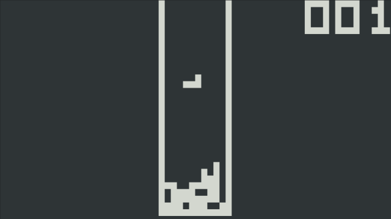

# CHIP-8 Emulator

CHIP-8 ([CHIP-8 - Wikipedia](https://en.wikipedia.org/wiki/CHIP-8)) emulator 
written in C++20.

### Features
- [x] Graphical mode (OpenGL)
- [x] Terminal mode (Ncurses)
- [x] Sound (SoLoud + ALSA)
- [x] Customizable CPU's instructions per second
- [x] Customizable scaling
- [x] All tests passed (`programs/test-suite.ch8`)




### Build
```
mkdir build
cd build
cmake ..
make
```

### Usage

```
USAGE
    chip8 [OPTION...] ROM

OPTIONS
  -f, --frequency=FREQ       CPU instructions per seconds (default is 700)
  -m, --no-sound             Disable sound
  -s, --scaling=SCALING      Video scaling factor (default is 15)
  -v, --video=VIDEO          Set video mode ('opengl', 'curses', 'dummy')
```

Examples:

Run Brix
```
chip8 games/brix.ch8
```

Run Tetris in terminal
```
chip8 games/brix.ch8 -v curses
```

### Input

```
    CHIP-8            Keyboard
1 | 2 | 3 | C       1 | 2 | 3 | 4
4 | 5 | 6 | D       Q | W | E | R
7 | 8 | 9 | E       A | S | D | F
A | 0 | B | F       Z | X | C | V
```

```
ESC    =  Quit
Space  =  Reset
```

