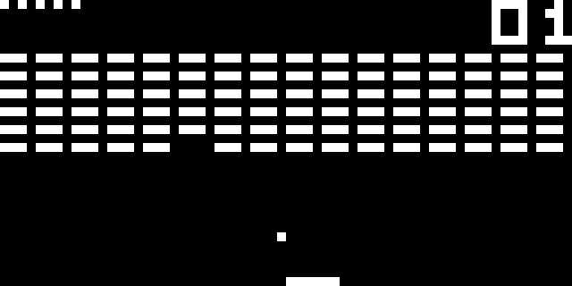

# CHIP-8 Emulator

CHIP-8 ([CHIP-8 - Wikipedia](https://en.wikipedia.org/wiki/CHIP-8)) emulator 
written in C++20.

Uses OpenGL as graphics library and SoLoud as sound library (requires ALSA as audio backend).



### Build
```
mkdir build
cd build
cmake ..
make
```

### Usage

```
USAGE
    chip8 [OPTION...] ROM

OPTIONS
  -f, --frequency=FREQ       CPU instructions per seconds (default is 700)
  -s, --scaling=SCALING      Scaling factor (default is 15)
```